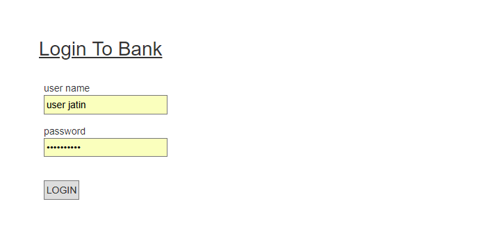
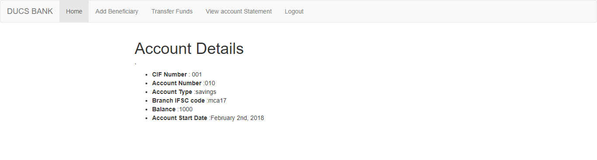
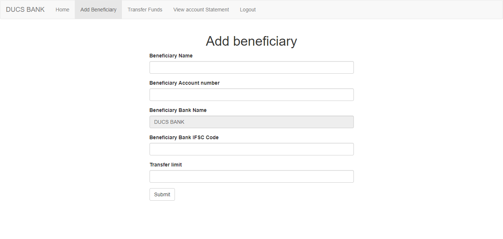
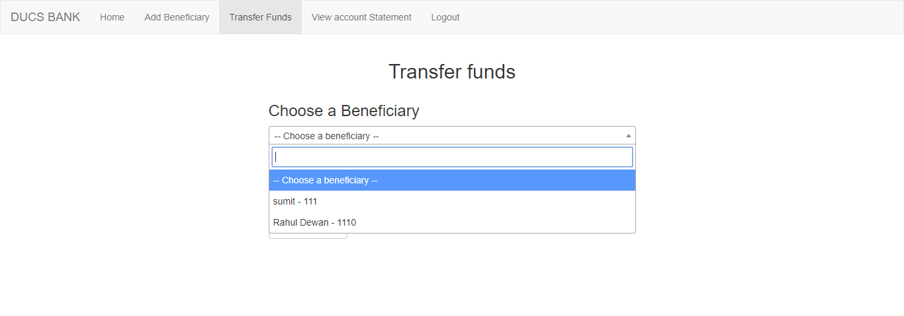
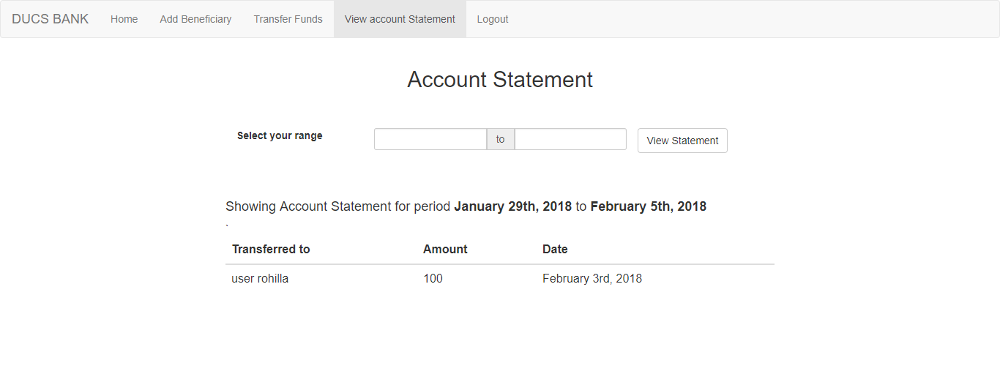
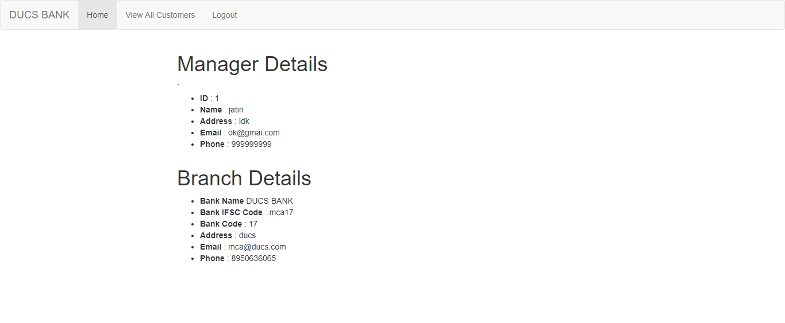
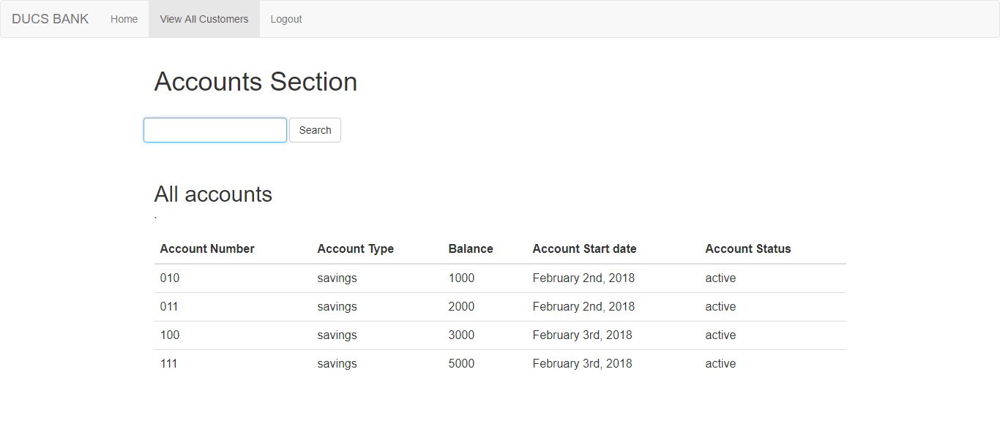

# DUCS Bank : Online Banking System

- Basic php project with little Bootstrap and a few plugins as required.
- made overnight for Intra sankalan web dev event
- Can be used for basic references, but should not to be used for production.
- Database can be improved by investing time.
- Find the [question statement here](./question.pdf)
- Find the [Database dump here](./database_dump/)

## Test Stack
- Xampp stack v3.2.2  
- PHP 7.1 , MYSQLi 5.0
- Netbeans 8.x and sublime text 3.x
- MySQL workbench
- chrome 64

## Screenshots

#### Login Page

#### Customer Portal

#### Manager Portal

